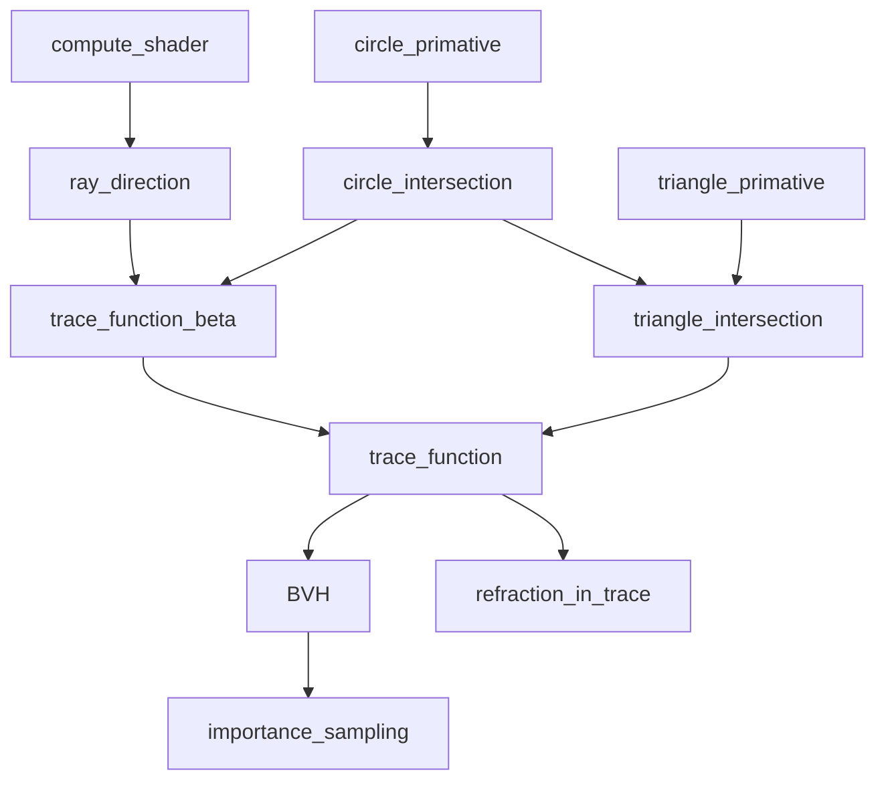
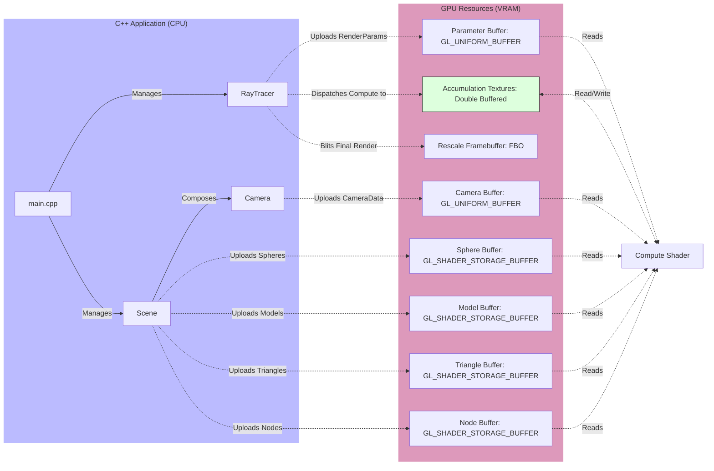
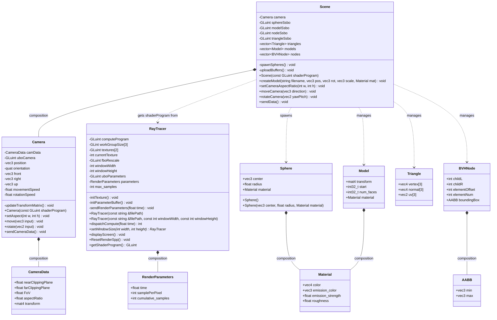
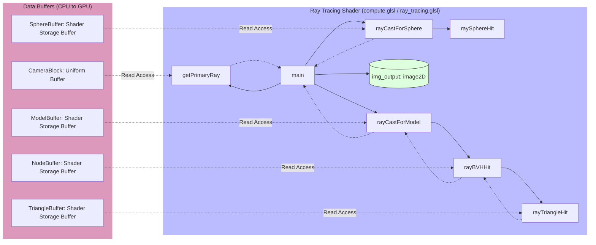

# Project Structure

The project is organized into the following main directories, each serving a specific purpose:

```shell
[root]/
├── doc/            # Project documentation.
├── example/        # Example code demonstrating features.
├── renderer/       # Core rendering engine components, interface of render pipeline.
├── scene/          # Scene data management, camera, and object definitions.
├── shader/         # GLSL shader programs for rendering.
├── cyCodeBase/     # External libraries, utility classes for BVH, mesh loading, vectors.
├── submodules/     # External libraries integrated as Git submodules. 
│   └── stb/        # Single-file public domain libraries for image I/O.
├── utils/          # Utility functions for loading files.
├── main.cpp        # The primary entry point of the application.
└── CMakeLists.txt  # The main CMake build configuration file for the project.
```

# Roadmap



## Program Architecture

### Overview



### C++ Side



### Shader Side



The shader architecture follows a standard ray tracing pipeline:
1.  **Entry Point (`main`)**: Orchestrates the ray tracing process for each pixel.
2.  **Ray Generation (`getPrimaryRay`)**: Uses `CameraBlock` uniform data to transform pixel coordinates into world-space rays.
3.  **Intersection Logic (`rayCastForSphere` & `raySphereHit`)**: Iterates through the `SphereBuffer` to find the closest intersection point.
4.  **Model Intersection (`rayCastForModel`, `rayBVHHit`, & `rayTriangleHit`)**: Traverses the Bounding Volume Hierarchy (BVH) stored in `NodeBuffer` and `TriangleBuffer` to efficiently find mesh geometry intersections.
5.  **Output**: Stores the resulting color (e.g., normal mapping or depth) into the `img_output` texture.

# References

- [How to Install and Use GLUT in Visual Studio Code | Medium](https://medium.com/@aleksej.gudkov/how-to-install-and-use-glut-in-visual-studio-code-46c30243b264)
- [C++ OpenGL setup for VSCode in 2min](https://www.youtube.com/watch?v=Y4F0tI7WlDs)
- [Modern OpenGL Tutorial - Compute Shaders](https://www.youtube.com/watch?v=nF4X9BIUzx0)
- [Random directions on hemisphere](https://math.stackexchange.com/questions/1163260/random-directions-on-hemisphere-oriented-by-an-arbitrary-vector)
- [Coding Adventure: Ray Tracing](https://www.youtube.com/watch?v=Qz0KTGYJtUk)
- [Sampling the hemisphere](https://ameye.dev/notes/sampling-the-hemisphere/)
- [Cosine-weighted-sampling](https://pema.dev/obsidian/math/light-transport/cosine-weighted-sampling.html)
- Real-Time Rendering, Third Edition, Tomas Akenine-Moller, Eric Haines, Naty Hoffman
- [Ray Tracing in One Weekend](https://raytracing.github.io/)
- [How to build a BVH](https://jacco.ompf2.com/2022/04/13/how-to-build-a-bvh-part-1-basics/)
- [Temporally Reliable Motion Vectors for Real-time Ray Tracing | Eurographics'2021 Full Paper](https://www.youtube.com/watch?v=ufVarD6RE9g)
- [Rendering (186.101, 2021S)](https://youtube.com/playlist?list=PLmIqTlJ6KsE2yXzeq02hqCDpOdtj6n6A9&si=_YAiQi0fx4PJSWTR)

## Tutorials

- [OpenGL Official Index](https://wikis.khronos.org/opengl/Getting_Started#Tutorials_and_How_To_Guides)
- [OpenGLBook Index](https://openglbook.com/)
- [Learn OpenGL | GLFW](https://learnopengl.com/)
- [OGL | GLUT](https://ogldev.org/)
- [Anton's OpenGL 4 Tutorials (with ray trace) | Glad | GLFW](https://antongerdelan.net/opengl/)
- [opengl-tutorial | GLFW](https://www.opengl-tutorial.org/)
