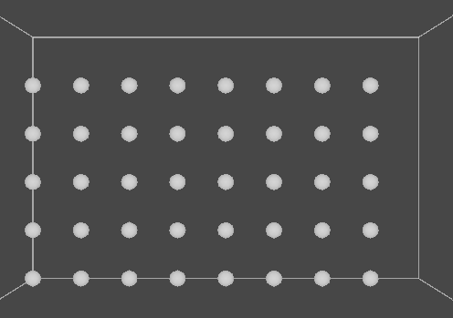
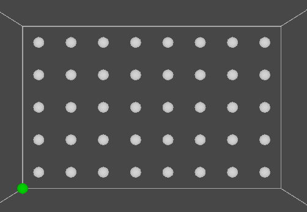
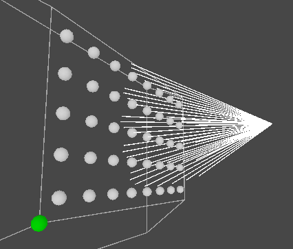
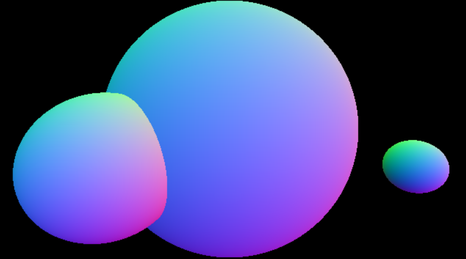
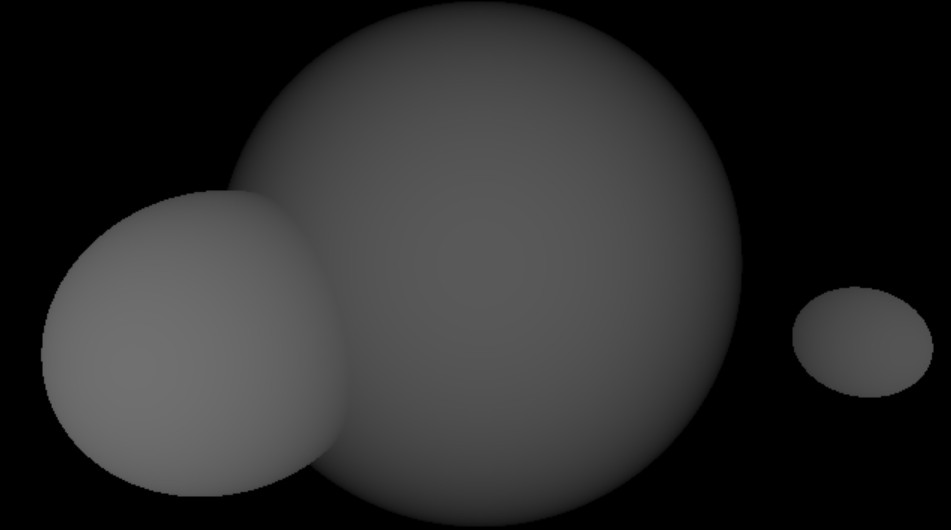
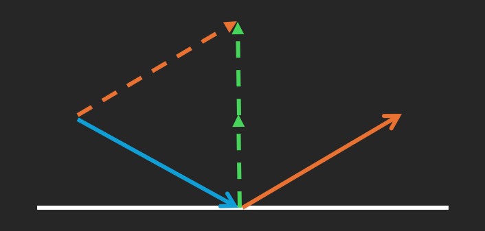
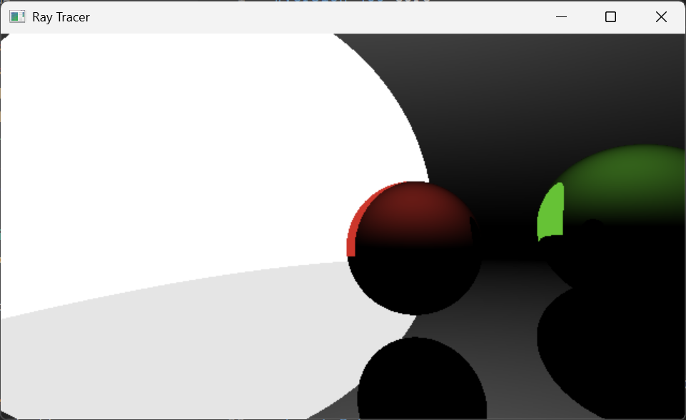
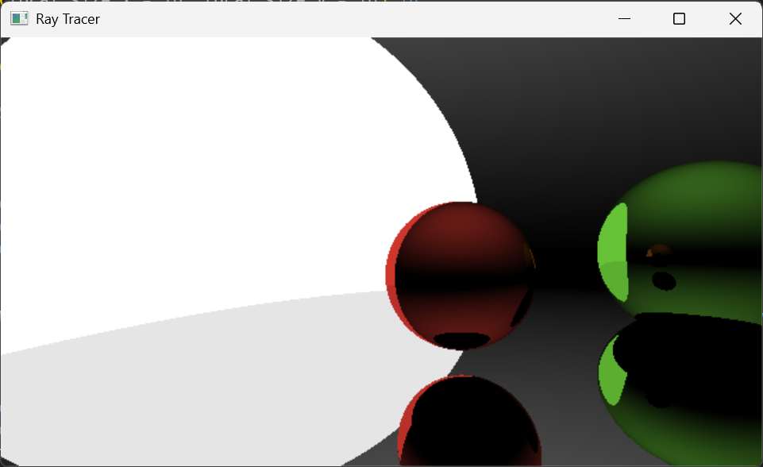
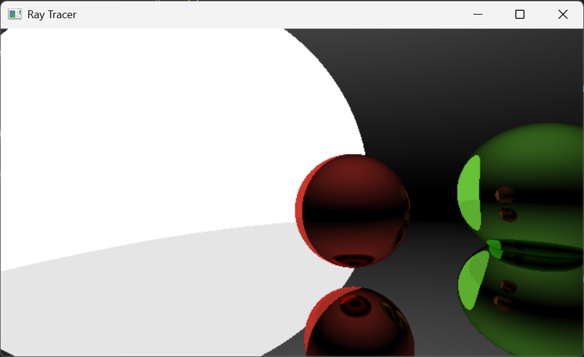

# Phase 1: Basic Ray Tracer

## Primary ray generation

Ray tracing algorithm calculates a pixel color by casting a ray from the camera towards that pixel. The first step of ray tracing is to generate rays, represented by origin and direction.
The origin of the ray is the camera position. The direction is the vector from origin to a pixel, so the goal is to calculate pixel position.

### pixel position

Imagine a plane in front of the camera where rays project onto it and then form an image. The pixel positions lie on that plane. There are infinite such planes we can use to calculate ray directions if we don't constraint their length.

After I fixed the plane to a certain distance away, the only variance that can affect ray directions is the **field of view**, which is a configurable parameter of the camera.

Now that the width and height of the screen is definite, I first calculate the position of the bottom-left corner and then the offset from that corner according to screen space pixel position. The result is the corner of each pixel, so we need to offset by 0.5 to move to the center.

The direction of rays are finally acquired by subtraction and normalization. Rays are calculated in camera's local coordinate, we can multiply by its transformation matrix to get the rays in the global coordinate.

|      |      |      |
| ---- | ---- | ---- |
|  |  |  |

## Sphere primitive calculation

A ray needs to hit an object so that the color of the pixel can be calculated. The key information of a hit is the position and surface normal. Before we can render complex meshes, it is easier to just render some simple shapes that are lightweight and easy to compute ray-object intersection. A sphere is a good start because the intersection of a line and a sphere is easy to compute.

A ray can be represented by a point plus a direction,

$$
P = \text{origin} + t\cdot\text{direction}
$$

where $t$ is an arbitrary positive integer. By determining $t$, we can find a point on the ray. So the possible 2 intersection points can be obtained by solving the following equation:

$$
\text{radius}^2 = ||\text{center} - P||^2 \\
= ||\text{center} - (\text{origin} + t\cdot\text{direction})||^2
$$

This is a quadratic equation of $t$, and there is a formula to get the 2 roots of it.

With the basic intersection detection algorithm, I am able to find the point and normal on the surface of a sphere a ray hit. The following images are depth and normal which are rendered by ray casting.

|     |     |
| --- | --- |
|  |  |

### Side Track: Moving Camera

I implement camera fly-through movement, allowing the user to view the scene from different angles. The camera transform matrix and viewport parameters are synchronized via uniform buffer object.

### Side Track: SSBO

The scene comprising spheres was originally written in the compute shader. I move the scene data to the CPU code, and send it to the shader program using shader storage buffer object. This allows me to freely adjust and update the scene from the CPU side, and also pave the way for the future use, when I have to load 3D models. 

## Ray tracing function

The geometry of the sphere can now be probed by casting rays, I am able to implement a ray tracing function that calculates the path of a ray and the incoming light along it.

Assuming the surface of the sphere is smooth and only reflect light like a mirror, this way, I don't have to calculate scattering rays and the ray casting from camera towards a specific direction is deterministic. When a ray hit a surface, a reflection ray is generated. The hit point is its origin, and the direction is
$$
\text{reflect\_dir} = \text{ray\_dir} - 2 \cdot \text{normal} \cdot \text{ray\_dir}
$$

When a ray hits a surface, we multiply its color with the surface color to accumulate the influence along the path. When it hits a light source, we multiply ray color, light color, and light strength and add to the pixel color.

I placed 4 spheres in the scene, one of which is emissive, acting as a main light source. Besides, I also added a dim environment light to make the silhouette of them more conspicuous. There is a parameter to limit the number of reflection of a ray. When the number of reflection is set to 1, we can see the reflection of the main light in the other sphere. When it is increased to 2, the reflection of spheres appeared on each other. When it gets higher, more deeper reflection can be seen, at a cost of more computing resources.

| #reflection=1 | #reflection=2 | #reflection=5 |
| --- | --- | --- |
|  |  |  |

## Diffuse Reflection

General objects have no perfectly smooth surfaces, so to render realistic images, my next step is to expand the ray tracing function to compute diffuse light. I replaced the reflection function with a random direction generator.

### Random direction on a hemisphere

Because there is no built-in random number generator, I have to build one by bit shifting. This pseudo random number samples `float` [0 ,1] from a uniform distribution.

With this random number generator, there are several ways to get a random direction.

The most naive one is simply sample three floats and do normalization. But this has a significant flaw that points tends to grow denser at some corner, since is was sampled in a unit cube.

A workaround is to discard points outside the unit sphere, and the result is a perfect uniform distribution on the surface of the sphere. The drawback of this is that it requires an infinite loop that keep resample points once the previous one failed, although the average iterations is less than 2.

Another approach is to sample floats from a normal distribution, but this is more complex to compute than uniform distribution.

I ultimately adopt a formula that samples and rescales 2 floats to get the polar coordinate of a point. This method requires less expensive math operation (e.g cos, square root).

| More points on the edges | Even distribution  |
| --- | --- |
|  |  |

Finally, the goal is to generate directions on a hemisphere, however, the previous method generate points on a sphere. To fix it, we can examine whether a direction points outward by taking dot product, and flip the sign of the direction if it is negative.

### Noise

This is the result of the diffuse reflection. It looks terrible. Unlike smooth surface where lights travel along the same direction, diffuse reflection scatter rays stochastically.

According to the rendering equation, I need to sample an innumerable amount of rays to approximate the integration of incoming light. But in practice, I need to set a limit to the number of sample per pixel.

As the number of samples increases, the chaotic noise gradually yields to a clearer image, converging toward the true light transport. Observe how the stochastic artifacts diminish with higher sampling densities:

| 4 samples | 16 samples | 196 samples |
| --- | --- | --- |
|  |  |  |

