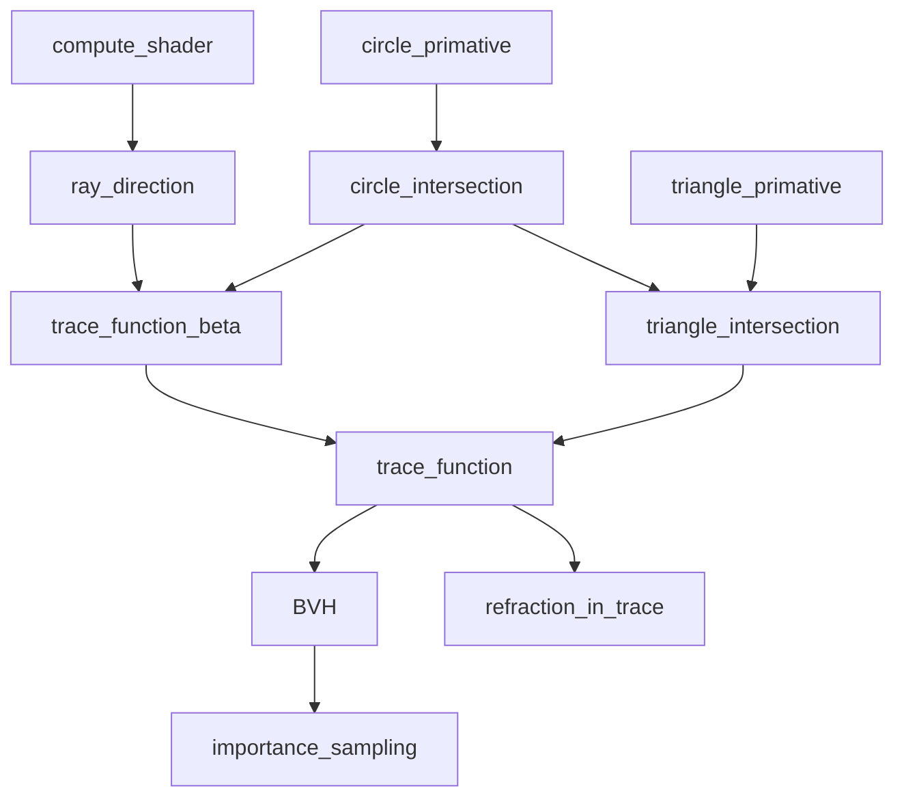
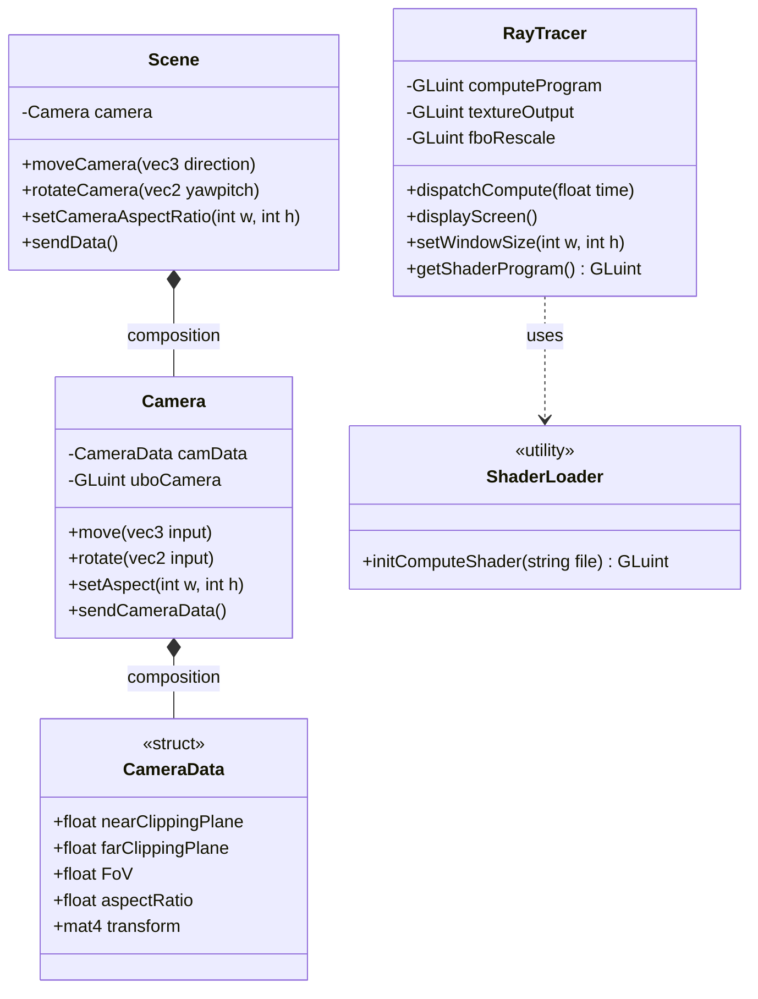
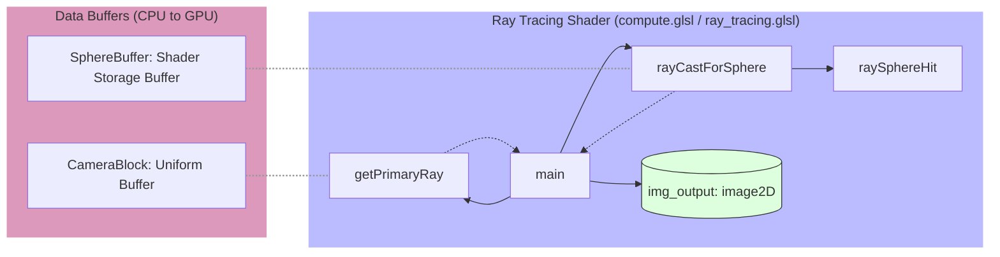

# Development Environment Setup

- OS: Windows 11
- C++ compiler: Msys2 mingw-w64

## Install Packages

In the MinGW-w64 terminal, run:

```shell
pacman -S mingw-w64-x86_64-freeglut
pacman -S mingw-w64-x86_64-glew
```

## Compile

```shell
g++ main.cpp -o main.exe \
  -I 'C:/msys64/mingw64/include' \
  -lfreeglut -lglu32 -lopengl32 -lglew32 \
```

# Roadmap



## Program Architecture

### C++ Side



### Shader Side



The shader architecture follows a standard ray tracing pipeline:
1.  **Entry Point (`main`)**: Orchestrates the ray tracing process for each pixel.
2.  **Ray Generation (`getPrimaryRay`)**: Uses `CameraBlock` uniform data to transform pixel coordinates into world-space rays.
3.  **Intersection Logic (`rayCastForSphere` & `raySphereHit`)**: Iterates through the `SphereBuffer` to find the closest intersection point.
4.  **Output**: Stores the resulting color (e.g., normal mapping or depth) into the `img_output` texture.

# References

- [How to Install and Use GLUT in Visual Studio Code | Medium](https://medium.com/@aleksej.gudkov/how-to-install-and-use-glut-in-visual-studio-code-46c30243b264)
- [C++ OpenGL setup for VSCode in 2min](https://www.youtube.com/watch?v=Y4F0tI7WlDs)
- [Modern OpenGL Tutorial - Compute Shaders](https://www.youtube.com/watch?v=nF4X9BIUzx0)
- [Random directions on hemisphere](https://math.stackexchange.com/questions/1163260/random-directions-on-hemisphere-oriented-by-an-arbitrary-vector)
- [Coding Adventure: Ray Tracing](https://www.youtube.com/watch?v=Qz0KTGYJtUk)

## Tutorials

- [OpenGL Official Index](https://wikis.khronos.org/opengl/Getting_Started#Tutorials_and_How_To_Guides)
- [OpenGLBook Index](https://openglbook.com/)
- [Learn OpenGL | GLFW](https://learnopengl.com/)
- [OGL | GLUT](https://ogldev.org/)
- [Anton's OpenGL 4 Tutorials (with ray trace) | Glad | GLFW](https://antongerdelan.net/opengl/)
- [opengl-tutorial | GLFW](https://www.opengl-tutorial.org/)